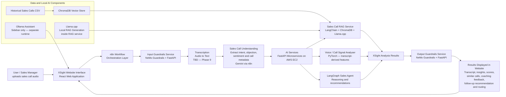

# XSight — AI Sales Call Analytics System

Full project specification for Claude Code sessions. This file is the source of truth for project scope, architecture, technology decisions, phases, and working conventions. Read this file at the start of every session.

## Working conventions

- Work on ONE phase at a time. Never start the next phase without explicit user approval.
- Before implementing, briefly explain in Hebrew what is about to be done and why.
- At the end of each phase: summarize in Hebrew what was created and how to verify it works, then commit to git with message "Phase N: <description>".
- If anything in this spec is ambiguous or contradictory, ASK the user instead of inventing a solution.
- Maintain `docs/PROGRESS.md` tracking completed phases and open decisions.
- Each Python service gets its own `requirements.txt` and a `.env.example` file. Use Python 3.11+.
- Never commit secrets, model weights, ChromaDB data, or audio files (ensure `.gitignore` covers them).
- Explain all work to the user in Hebrew. All code, comments, and documentation must be in English.

**Important:** This is a completely new version of XSight. It is NOT the old XSight project. The old project used Flask, Amazon Bedrock Agent, Bedrock Knowledge Base, S3, metadata CSV files and Action Groups. This new project is rebuilt from zero with a new architecture and different technologies.

---

## Project idea

XSight is a voice-based sales call analytics system. The system allows a user such as a sales manager or sales team leader to upload a recorded sales call audio file. The system transcribes the audio, analyzes the sales conversation, extracts structured insights, compares the call to similar historical sales calls, predicts sales signals, and returns practical coaching and follow-up recommendations.

### Short project description

The system analyzes voice-based sales calls to identify why a call succeeded or failed, including customer intent, objections, and sentiment. It provides sales teams with clear insights, coaching feedback, recommended next steps, and comparisons to similar past calls.

### Main users

- Sales managers
- Sales team leaders
- Sales agents
- Sales operations teams

### Main questions the system should answer

- Why did the call succeed or fail?
- What was the customer intent?
- What objections appeared?
- What was the customer sentiment?
- How well did the agent handle objections?
- Was there a missed opportunity?
- Is follow-up needed?
- What coaching feedback should be given?
- Which similar historical calls help explain this result?

---

## Language decision

All transcripts, dataset content, prompts, code, comments, and documentation are in English. The transcription API must support English audio.

---

## Final output

The final output is a full sales call analysis result displayed in a React website. It must include:

- transcript
- call summary
- extracted insights
- customer intent
- main objection
- customer sentiment
- call outcome
- agent performance score
- lead quality score
- similar historical calls (with call_id citations)
- coaching feedback
- recommended next action
- suggested follow-up email
- routing category
- confidence level
- limitations

### Final output JSON schema (contract between backend and React frontend)

```json
{
  "transcript": "string",
  "call_summary": "string",
  "customer_intent": "string",
  "main_objection": "string",
  "customer_sentiment": "positive | neutral | negative",
  "call_outcome": "Sale | No Sale | Follow-up Needed | Uncertain",
  "agent_performance_score": "integer 1-5",
  "lead_quality_score": "integer 1-5",
  "similar_calls": [
    {
      "call_id": "string",
      "agent_name": "string",
      "sale_result": "string",
      "main_objection": "string",
      "similarity_score": "float",
      "reason": "string"
    }
  ],
  "coaching_feedback": ["string"],
  "recommended_next_action": "string",
  "suggested_follow_up_email": "string",
  "routing_category": "string",
  "confidence": "float 0-1",
  "risk_level": "Low | Medium | High",
  "detected_signals": ["string"],
  "limitations": "string",
  "guardrail_status": "pass | flagged | human_review_required"
}
```

---

## Final chosen technology stack

1. **Frontend:** React Web Application (built near end of project — not at the beginning)
2. **Orchestration:** n8n Cloud
3. **Transcription:** External API — TBD at Phase 9. Ask before implementing.
4. **n8n LLM:** Gemini
5. **Guardrails:** NeMo Guardrails + FastAPI (custom rule-based validation may supplement NeMo where needed)
6. **RAG:** LangChain + ChromaDB + HuggingFace embeddings + Llama.cpp. Embedding model: `sentence-transformers/all-MiniLM-L6-v2`
7. **Voice / Call Signal Analysis:** PyTorch feature-based classifier. Audio features are derived from the transcript only — no librosa, no audio file processing in this service. Features derived from transcript: duration estimate from word count, agent_talk_ratio from speaker-tagged lines, speaking_rate_wpm, price_mentions_count, competitor_mentions_count.
8. **Agent:** LangGraph — planner → tool execution → synthesizer graph. Exposed via FastAPI.
9. **Local Assistant:** Ollama — runs separately from Llama.cpp. Ollama serves the React sidebar assistant only. Llama.cpp runs inside the RAG service only. These are two separate runtimes and must not be merged.
10. **Data:** CSV + ChromaDB
11. **Deployment:** Docker locally first, then AWS EC2

---

## n8n and local services connectivity note

During local development, n8n Cloud cannot reach localhost directly. Expose local FastAPI services to n8n Cloud using ngrok or Cloudflare Tunnel. Alternatively, run n8n locally inside Docker Compose during early phases. Document the chosen approach clearly at Phase 9.

---

## Architecture flow

```
User uploads sales call audio
→ React Web Application
→ n8n Cloud Workflow
→ Input Guardrails Service (NeMo)
→ Transcription API (TBD Phase 9)
→ Sales Call Understanding / Information Extraction (Gemini via n8n)
→ FastAPI AI Microservices on AWS EC2:
  → Sales Call RAG Service
  → Voice / Call Signal Analyser
  → LangGraph Sales Agent
→ Sales Call Analysis Results
→ Output Guardrails Service (NeMo)
→ Results displayed in React website
```

### Architecture Mermaid diagram



---

## Main system components

### 1. React Web Application

Built near end of project — Phase 16 onwards. Do not implement during early phases. During Phases 1–15, test via curl, Postman, and direct n8n webhook calls.

**Main sections:**
- Home / project overview
- Sales Call Upload
- Results Page
- Analytics Dashboard
- Ollama Assistant sidebar panel

**Upload form fields:**
- audio file upload
- agent name
- call date
- optional customer/company name
- optional notes
- submit button

Results display must include all fields from the final output JSON schema above.

### 2. n8n Cloud Workflow

Orchestration layer. Receives the submission, calls services, manages the AI workflow, returns the final response.

**Planned n8n nodes:**
1. Webhook Trigger
2. Input Guardrails HTTP Request (NeMo)
3. IF pass/fail
4. Transcription API HTTP Request (TBD Phase 9)
5. Information Extractor — Gemini (prompt engineering surface)
6. HTTP Request to RAG Service
7. HTTP Request to Call Signal Analyser
8. HTTP Request to LangGraph Agent
9. Final Analysis Generation — Gemini (prompt engineering surface)
10. Output Guardrails HTTP Request (NeMo)
11. IF safe / human review
12. Respond to Webhook

**Confidence routing rule:** If the Call Signal Analyser returns confidence < 0.65, the n8n IF node (node 11) must route to `human_review_required` instead of returning the result directly.

### 3. Sales Call RAG Service

Location: `services/rag_service`
Stack: FastAPI, LangChain, ChromaDB, HuggingFace embeddings, Llama.cpp

Endpoint: `POST /query`

Input:
```json
{
  "transcript": "...",
  "metadata": {
    "agent_name": "Sarah Levi",
    "call_duration_seconds": 420,
    "sale_result": "No Sale"
  }
}
```

Output:
```json
{
  "similar_calls": [
    {
      "call_id": "CALL_003",
      "agent_name": "Daniel Cohen",
      "sale_result": "Sale",
      "main_objection": "price",
      "similarity_score": 0.89,
      "reason": "Similar price objection with high customer intent."
    }
  ],
  "insight": "The current call resembles CALL_003 because both include price objection and high customer interest.",
  "citations": ["CALL_003"]
}
```

**RAG rules:**
- Use only retrieved historical calls. Never invent CRM facts, budgets, prices, customer names, or outcomes.
- Every claim about a historical call must cite its call_id.
- If evidence is missing, return "Not enough evidence".

### 4. Voice / Call Signal Analyser

Location: `services/call_signal_analyser`
Stack: FastAPI, PyTorch, pandas

Endpoint: `POST /analyse-call`

All features are derived from the transcript text only. No audio file is processed by this service.

**Transcript-derived features:**
- `call_duration_seconds`: estimated from word count (average 130 wpm)
- `silence_ratio`: not available from transcript — set to 0.0 and note limitation
- `speaking_rate_wpm`: word count / estimated duration
- `agent_talk_ratio`: agent word count / total word count (requires Agent:/Customer: tagged transcript)
- `price_mentions_count`: keyword count
- `competitor_mentions_count`: keyword count
- `customer_intent`: encoded from extracted field
- `main_objection`: encoded from extracted field
- `customer_sentiment`: encoded from extracted field
- `closing_attempt`: encoded from extracted field

Output:
```json
{
  "predicted_outcome": "Follow-up Needed",
  "lead_quality_score": 4,
  "agent_performance_score": 3,
  "risk_level": "Medium",
  "confidence": 0.86,
  "detected_signals": [
    "price objection",
    "high customer interest",
    "weak closing attempt"
  ]
}
```

If confidence < 0.65: return "Uncertain" and flag for human review.

### 5. Guardrails Service

Location: `services/guardrails_service`
Stack: FastAPI, NeMo Guardrails

Endpoints:
- `POST /check/input`
- `POST /check/output`

**Input guardrails detect:**
- empty or too-short transcript
- off-topic or non-sales-call content
- offensive content
- prompt injection attempts
- unsupported metadata or invalid file information

**Output guardrails detect:**
- invented CRM facts
- unsupported business conclusions
- fake legal or financial promises
- overconfident recommendations
- invented call details
- missing call_id citations for claims based on historical calls

Response format:
```json
{
  "pass": true,
  "reason": "",
  "flags": [],
  "safe_text": "..."
}
```

### 6. LangGraph Sales Agent

Location: `services/langgraph_agent`
Stack: FastAPI, LangGraph

Endpoint: `POST /agent/run`

Graph: Planner Node → Tool Execution Node → Synthesizer Node

Tools: RAG tool, Call Signal Analyser tool, Follow-up recommendation tool

Input:
```json
{
  "question": "Why did this call fail and what should the agent improve?",
  "transcript": "...",
  "metadata": {},
  "analysis": {}
}
```

Output:
```json
{
  "answer": "...",
  "tools_used": ["rag_service", "call_signal_analyser"],
  "reasoning_steps": [
    "Detected main objection",
    "Compared with similar failed calls",
    "Generated coaching recommendation"
  ],
  "recommended_next_action": "...",
  "coaching_feedback": []
}
```

### 7. Data Design

Location: `data/historical_sales_calls.csv`

All content in English. The dataset must support both RAG retrieval and PyTorch classification.

**Structure:**
- 20–30 detailed records with full transcripts for RAG retrieval quality
- An additional 150–300 synthetic rows with features and labels only (no full transcript) for PyTorch classifier training

**Columns:**
`call_id, agent_name, transcript, call_duration_seconds, sale_result, customer_intent, main_objection, customer_sentiment, agent_performance_score, objection_handling_quality, closing_attempt, follow_up_needed, lead_quality_score, call_category, silence_ratio, speaking_rate_wpm, agent_talk_ratio, price_mentions_count, competitor_mentions_count, risk_level, predicted_outcome_label`

**Include:**
- successful calls, failed calls, follow-up-needed calls
- objections: price, timing, trust, competitor, no_need, authority
- different agents
- values consistent with transcript content

### 8. Prompt Engineering Log

Location: `docs/prompt_engineering_log.md`

Minimum 5 iterations per surface.

**Surfaces:**
1. n8n Information Extractor prompt
2. n8n Final Analysis prompt
3. LangChain RAG prompt (citation and grounding instructions)
4. NeMo Guardrails rail prompts (input + output)
5. Ollama Assistant system prompt
6. LangGraph tool descriptions

**Per surface include:**
- goal
- versions 1–5 with: failure mode, change made, test result, pass rate
- 10 benchmark test cases
- final justified prompt

### 9. Demo Plan (5–8 minutes)

- project overview
- backend services tested with curl/Postman
- n8n webhook called directly
- valid sales call audio uploaded
- automatic transcription
- extracted sales insights
- similar historical calls from RAG (with citations)
- PyTorch signal scoring
- LangGraph recommendations
- output guardrails validation
- results displayed in React website
- invalid/unsafe input rejected by input guardrails
- human review case (confidence < 0.65)
- Ollama Assistant conversation

### 10. Repository structure

```
xsight-ai-sales-call-analytics/
├── CLAUDE.md                  ← full project spec saved here
├── frontend/
├── n8n/
├── services/
│   ├── rag_service/
│   ├── call_signal_analyser/
│   ├── guardrails_service/
│   └── langgraph_agent/
├── data/
├── models/
├── docs/
│   ├── PROGRESS.md
│   └── prompt_engineering_log.md
├── demo/
├── docker-compose.yml
├── README.md
└── .gitignore
```

---

## Development strategy

Do not build the entire system at once. Work in phases. Do not build the React frontend before Phase 16. Test everything via curl, Postman, and direct n8n webhook calls during Phases 1–15.

### Phases

- **Phase 1:** Repository structure
- **Phase 2:** README and project documentation
- **Phase 3:** Technology decisions document
- **Phase 4:** Architecture document with Mermaid diagram
- **Phase 5:** Adapted CSV dataset
- **Phase 6:** FastAPI mock service skeletons
- **Phase 7:** Docker Compose for local backend services
- **Phase 8:** curl/Postman testing documentation
- **Phase 9:** Transcription API decision + mock n8n webhook flow
- **Phase 10:** Connect n8n to mock FastAPI services (ngrok or local n8n)
- **Phase 11:** Implement NeMo Guardrails service
- **Phase 12:** Implement RAG service
- **Phase 13:** Implement PyTorch call signal analyser
- **Phase 14:** Implement LangGraph agent
- **Phase 15:** Test full backend and n8n flow end-to-end without frontend
- **Phase 16:** React application skeleton
- **Phase 17:** Connect React to n8n webhook
- **Phase 18:** Add results dashboard and Ollama Assistant panel
- **Phase 19:** Docker, EC2 deployment notes and final demo documentation
- **Phase 20:** Prompt engineering log and final cleanup

### Phase acceptance criteria

- Phase 1 complete when: all folders exist, placeholder READMEs are in place, CLAUDE.md contains this full spec, PROGRESS.md exists, .gitignore is complete.
- For all other phases: each phase is complete when the user explicitly confirms it, after reviewing the Hebrew summary of what was built.
