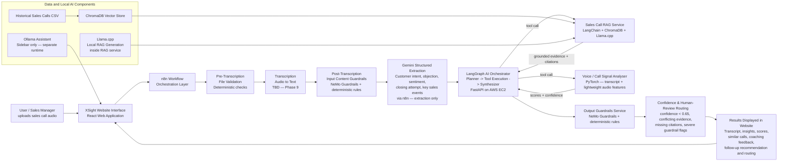

# XSight — AI Sales Call Analytics System

Full project specification for Claude Code sessions. This file is the source of truth for project scope, architecture, technology decisions, phases, and working conventions. Read this file at the start of every session.

## Working conventions

- Work on ONE phase at a time. Never start the next phase without explicit user approval.
- Before implementing, briefly explain in Hebrew what is about to be done and why.
- At the end of each phase: summarize in Hebrew what was created and how to verify it works, then commit to git with message "Phase N: <description>".
- If anything in this spec is ambiguous or contradictory, ASK the user instead of inventing a solution.
- Maintain `docs/PROGRESS.md` tracking completed phases and open decisions.
- Each Python service gets its own `requirements.txt` and a `.env.example` file. Use Python 3.11+.
- Never commit secrets, model weights, ChromaDB data, or audio files (ensure `.gitignore` covers them).
- Explain all work to the user in Hebrew. All code, comments, and documentation must be in English.

**Important:** This is a completely new version of XSight. It is NOT the old XSight project. The old project used Flask, Amazon Bedrock Agent, Bedrock Knowledge Base, S3, metadata CSV files and Action Groups. This new project is rebuilt from zero with a new architecture and different technologies.

---

## Project idea

XSight is a voice-based sales call analytics system. The system allows a user such as a sales manager or sales team leader to upload a recorded sales call audio file. The system transcribes the audio, analyzes the sales conversation, extracts structured insights, compares the call to similar historical sales calls, predicts sales signals, and returns practical coaching and follow-up recommendations.

### Short project description

The system analyzes voice-based sales calls to identify why a call succeeded or failed, including customer intent, objections, and sentiment. It provides sales teams with clear insights, coaching feedback, recommended next steps, and comparisons to similar past calls.

### Main users

- Sales managers
- Sales team leaders
- Sales agents
- Sales operations teams

### Main questions the system should answer

- Why did the call succeed or fail?
- What was the customer intent?
- What objections appeared?
- What was the customer sentiment?
- How well did the agent handle objections?
- Was there a missed opportunity?
- Is follow-up needed?
- What coaching feedback should be given?
- Which similar historical calls help explain this result?

---

## Language decision

All transcripts, dataset content, prompts, code, comments, and documentation are in English. The transcription API must support English audio.

---

## Final output

The final output is a full sales call analysis result displayed in a React website. It must include:

- transcript
- call summary
- extracted insights
- customer intent
- main objection
- customer sentiment
- call outcome
- agent performance score
- lead quality score
- similar historical calls (with call_id citations)
- coaching feedback
- recommended next action
- suggested follow-up email
- routing category
- confidence level
- limitations

### Final output JSON schema (contract between backend and React frontend)

```json
{
  "transcript": "string",
  "call_summary": "string",
  "customer_intent": "string",
  "main_objection": "string",
  "customer_sentiment": "positive | neutral | negative",
  "call_outcome": "Sale | No Sale | Follow-up Needed | Uncertain",
  "agent_performance_score": "integer 1-5",
  "lead_quality_score": "integer 1-5",
  "similar_calls": [
    {
      "call_id": "string",
      "agent_name": "string",
      "sale_result": "string",
      "main_objection": "string",
      "similarity_score": "float",
      "reason": "string"
    }
  ],
  "coaching_feedback": ["string"],
  "recommended_next_action": "string",
  "suggested_follow_up_email": "string",
  "routing_category": "string",
  "confidence": "float 0-1",
  "risk_level": "Low | Medium | High",
  "detected_signals": ["string"],
  "limitations": "string",
  "guardrail_status": "pass | flagged | human_review_required"
}
```

---

## Final chosen technology stack

1. **Frontend:** React Web Application (built near end of project — not at the beginning)
2. **Orchestration:** n8n Cloud — operational workflow orchestration only (webhook handling, guardrails calls, transcription call, a single call to the LangGraph agent, response routing). n8n does not perform AI reasoning and does not call the RAG Service or Call Signal Analyser directly — LangGraph does, as tools.
3. **Transcription:** External API — TBD at Phase 9. Ask before implementing.
4. **Gemini (via n8n):** structured semantic extraction only — reads the validated transcript and extracts customer intent, main objection, customer sentiment, closing attempt, key sales events, and relevant call metadata. Does not generate coaching feedback, recommendations, or the final analysis.
5. **Guardrails:** NeMo Guardrails + FastAPI + deterministic custom validation rules. NeMo Guardrails handles topic restrictions, unsafe content, prompt injection, jailbreak attempts, and other LLM-oriented input/output policies. Deterministic rules handle checks such as empty input, transcript length, missing citations, invalid schemas, unsupported file formats, and required fields. Input validation runs in two stages — pre-transcription file validation and post-transcription content guardrails — see Architecture flow.
6. **RAG:** LangChain + ChromaDB + HuggingFace embeddings + Llama.cpp. Embedding model: `sentence-transformers/all-MiniLM-L6-v2`. Retrieval of grounded historical-call evidence only — invoked by LangGraph as a tool, not called directly by n8n.
7. **Voice / Call Signal Analysis:** PyTorch feature-based classifier over an engineered feature vector — not a raw-audio deep learning model. Prediction, scoring, and confidence estimation only — invoked by LangGraph as a tool, not called directly by n8n. Combines transcript-derived / structured-extraction features (word count, question count, price/competitor mention counts, customer intent, main objection, customer sentiment, closing attempt, speaker-tagged agent_talk_ratio when diarization is available — sourced from Gemini's extraction, not independently re-derived) with lightweight audio-derived features (call duration, silence ratio, speaking rate, speech-to-non-speech ratio, pause duration, interruptions, optional average pitch/energy level). Audio preprocessing is lightweight, not full acoustic/deep-learning feature extraction. Features that are unavailable must be marked missing/unknown rather than fabricated — e.g. `silence_ratio` must never be silently defaulted to 0.0.
8. **Agent:** LangGraph — the system's single AI orchestrator and final synthesis layer: planner → tool execution → synthesizer graph. Decides which tools are needed, invokes the RAG Service and Call Signal Analyser as tools, reconciles their evidence, detects conflicting/missing/insufficient evidence, generates grounded coaching feedback, and returns the complete final output JSON. Exposed via FastAPI. LLM backend for the Planner/Synthesizer nodes: TBD — Phase 14.
9. **Local Assistant:** Ollama — runs separately from Llama.cpp. Ollama serves the React sidebar assistant only. Llama.cpp runs inside the RAG service only. These are two separate runtimes and must not be merged.
10. **Data:** CSV + ChromaDB
11. **Deployment:** Docker locally first, then AWS EC2

---

## Component responsibility boundaries

- **n8n:** operational workflow orchestration only — webhook handling, guardrails calls, the transcription call, a single call to the LangGraph agent, and response routing. No AI reasoning, no direct calls to the RAG Service or Call Signal Analyser.
- **Gemini (via n8n):** structured semantic extraction only — customer intent, main objection, customer sentiment, closing attempt, key sales events, and relevant call metadata from the validated transcript. Never generates coaching feedback, recommendations, or the final analysis.
- **LangGraph:** AI orchestration, tool execution, evidence reconciliation, reasoning, and final response generation. Decides which tools are required, invokes the RAG Service and Call Signal Analyser as tools, combines the transcript, Gemini's structured extraction, retrieved evidence, and model scores, detects conflicting/missing/insufficient evidence, and returns the complete final output JSON.
- **RAG Service:** retrieval of grounded historical-call evidence only.
- **Call Signal Analyser:** prediction, scoring, and confidence estimation only — uses Gemini's structured extraction rather than re-deriving intent/objection/sentiment itself.
- **Guardrails Service:** input validation (both stages) and final-output validation only.

---

## n8n and local services connectivity note

During local development, n8n Cloud cannot reach localhost directly. Expose local FastAPI services to n8n Cloud using ngrok or Cloudflare Tunnel. Alternatively, run n8n locally inside Docker Compose during early phases. Document the chosen approach clearly at Phase 9.

---

## Architecture flow

```
User uploads sales call audio
→ React Web Application
→ n8n Cloud Workflow
→ Pre-Transcription File Validation (deterministic checks)
→ Transcription API (TBD Phase 9)
→ Post-Transcription Input Content Guardrails (NeMo + deterministic rules)
→ Gemini Structured Semantic Extraction (via n8n)
→ LangGraph AI Orchestrator (FastAPI on AWS EC2):
  → invokes Sales Call RAG Service (tool)
  → invokes Voice / Call Signal Analyser (tool)
  → reconciles evidence, reasons, synthesizes the complete final output
→ Output Guardrails Service (NeMo + deterministic rules)
→ Confidence and Human-Review Routing
→ Results displayed in React website
```

n8n makes exactly one call into the AI reasoning layer — to the LangGraph agent. LangGraph is the only component that calls the RAG Service and Call Signal Analyser; n8n never calls them directly.

**Note on staged input validation:** file-level checks (does the file exist, is it a supported audio format, is it within size/duration limits, are required metadata fields present) must run *before* transcription, since the transcript does not exist yet at that point. Content-level checks (empty/too-short transcript, off-topic content, offensive content, prompt injection) can only run *after* transcription, since they require the transcript text. See Guardrails Service (component 5) for the full breakdown of both stages.

### Architecture Mermaid diagram



---

## Main system components

### 1. React Web Application

Built near end of project — Phase 16 onwards. Do not implement during early phases. During Phases 1–15, test via curl, Postman, and direct n8n webhook calls.

**Main sections:**
- Home / project overview
- Sales Call Upload
- Results Page
- Analytics Dashboard
- Ollama Assistant sidebar panel

**Upload form fields:**
- audio file upload
- agent name
- call date
- optional customer/company name
- optional notes
- submit button

Results display must include all fields from the final output JSON schema above.

### 2. n8n Cloud Workflow

Orchestration layer. Receives the submission, calls services, manages the AI workflow, returns the final response.

**Planned n8n nodes:**
1. Webhook Trigger
2. Pre-Transcription File Validation HTTP Request (deterministic checks — file exists, MIME type/extension, size limit, optional duration limit, required metadata)
3. IF pass/fail (file validation)
4. Transcription API HTTP Request (TBD Phase 9)
5. Post-Transcription Input Content Guardrails HTTP Request (NeMo + deterministic rules)
6. IF pass/fail (content guardrails)
7. Information Extractor — Gemini structured semantic extraction only (prompt engineering surface)
8. HTTP Request to LangGraph Agent (single call — LangGraph internally invokes the RAG Service and Call Signal Analyser as tools, reconciles their evidence, and returns the complete final output)
9. Output Guardrails HTTP Request (NeMo + deterministic rules)
10. IF safe / human review
11. Respond to Webhook

Steps 2–3 (pre-transcription file validation) and 5–6 (post-transcription content guardrails) both call the Guardrails Service's `POST /check/input` endpoint, passing only the data available at that stage — see Guardrails Service (component 5) for the exact data available at each stage. n8n does not call the RAG Service or Call Signal Analyser directly — node 8 is the only AI-reasoning call n8n makes, and LangGraph owns everything downstream of it until the result comes back.

**Human review routing rule:** The n8n IF node (node 10) must route to `human_review_required` instead of returning the result directly whenever any of the following holds:
- the Call Signal Analyser's confidence < 0.65
- LangGraph detects conflicting evidence between the RAG Service and the Call Signal Analyser
- required supporting evidence or historical-call citations are missing
- the output guardrails report a severe issue
- a required tool fails and LangGraph cannot produce a sufficiently grounded result

### 3. Sales Call RAG Service

Location: `services/rag_service`
Stack: FastAPI, LangChain, ChromaDB, HuggingFace embeddings, Llama.cpp

Called by: the LangGraph agent only, as a tool. Not called directly by n8n.

Endpoint: `POST /query`

Input:
```json
{
  "transcript": "...",
  "metadata": {
    "agent_name": "Sarah Levi",
    "call_duration_seconds": 420,
    "sale_result": "No Sale"
  }
}
```

Output:
```json
{
  "similar_calls": [
    {
      "call_id": "CALL_003",
      "agent_name": "Daniel Cohen",
      "sale_result": "Sale",
      "main_objection": "price",
      "similarity_score": 0.89,
      "reason": "Similar price objection with high customer intent."
    }
  ],
  "insight": "The current call resembles CALL_003 because both include price objection and high customer interest.",
  "citations": ["CALL_003"]
}
```

**RAG rules:**
- Use only retrieved historical calls. Never invent CRM facts, budgets, prices, customer names, or outcomes.
- Every claim about a historical call must cite its call_id.
- If evidence is missing, return "Not enough evidence".

### 4. Voice / Call Signal Analyser

Location: `services/call_signal_analyser`
Stack: FastAPI, PyTorch, pandas, lightweight audio preprocessing (exact library finalized at Phase 13 — not librosa-scale acoustic feature extraction)

Called by: the LangGraph agent only, as a tool. Not called directly by n8n.

Endpoint: `POST /analyse-call`

The classifier is a feature-based model over an engineered feature vector — not a raw-audio deep learning model (no waveform/spectrogram input, no acoustic deep learning). Features come from three sources: transcript-derived features, structured fields already extracted upstream by Gemini, and lightweight audio-derived features computed from the original audio file. The service must primarily use Gemini's structured extraction for semantic fields (customer intent, main objection, customer sentiment, closing attempt) — it may use the transcript for deterministic feature calculation (word counts, keyword counts, speaker-tagged ratios), but it must not independently repeat intent, objection, or sentiment extraction as a separate analysis. A feature that cannot be computed for a given call (e.g. no diarization tags in the transcript, or the audio file is unavailable) must be marked missing/unknown in the request/response, never fabricated or silently defaulted.

**Transcript-derived and structured-extraction features:**
- `word_count`
- `question_count`
- `price_mentions_count`: keyword count
- `competitor_mentions_count`: keyword count
- `customer_intent`: from Gemini's structured extraction
- `main_objection`: from Gemini's structured extraction
- `customer_sentiment`: from Gemini's structured extraction
- `closing_attempt`: from Gemini's structured extraction
- `agent_talk_ratio`: agent word count / total word count — only computable when the transcript is speaker-tagged (Agent:/Customer:); marked missing/unknown otherwise

**Lightweight audio-derived features:**
- `call_duration_seconds`: measured directly from the audio file when available; falling back to a word-count-based estimate only when the audio file is unavailable, and explicitly flagged as an estimate in that case (never presented as a measured value)
- `silence_ratio`: measured via lightweight silence/energy detection on the audio file; marked missing/unknown if the audio file is unavailable — must never be silently defaulted to 0.0
- `speaking_rate_wpm`: word count / actual audio duration
- `speech_to_non_speech_ratio`
- `average_pause_duration_seconds`: mean length of detected pauses (optional — marked missing/unknown if not computable)
- `interruptions_count`: detected speaker overlaps, when timestamps/diarization allow it (optional — marked missing/unknown otherwise)
- `average_pitch_hz` (optional)
- `average_energy_level` (optional)

Output:
```json
{
  "predicted_outcome": "Follow-up Needed",
  "lead_quality_score": 4,
  "agent_performance_score": 3,
  "risk_level": "Medium",
  "confidence": 0.86,
  "detected_signals": [
    "price objection",
    "high customer interest",
    "weak closing attempt"
  ],
  "feature_summary": {
    "call_duration_seconds": 420,
    "agent_talk_ratio": 0.62,
    "speaking_rate_wpm": 145,
    "silence_ratio": 0.08,
    "price_mentions_count": 3
  }
}
```

`feature_summary` reports the key feature values the prediction was based on, so LangGraph (and a human reviewer) can see what drove the score, not just the score itself. If confidence < 0.65: return "Uncertain" and flag for human review.

### 5. Guardrails Service

Location: `services/guardrails_service`
Stack: FastAPI, NeMo Guardrails, deterministic custom validation rules

Endpoints:
- `POST /check/input`
- `POST /check/output`

NeMo Guardrails handles topic restrictions, unsafe content, prompt injection, and jailbreak/instruction-override attempts. Deterministic custom rules handle checks that don't need an LLM rail: empty input, transcript length, missing citations, invalid schemas, unsupported file formats, and required fields.

The Guardrails service exposes a single `POST /check/input` endpoint that is invoked at two different stages of the processing pipeline. During the first invocation (before transcription), the endpoint validates the uploaded audio file and submission metadata, including file type, file size, duration limits, required metadata, and submission integrity. During the second invocation (after transcription), the same endpoint validates the transcript content, including topic relevance, transcript quality, offensive content, prompt injection attempts, and other semantic checks. The validation logic is determined by the request payload and the data available at each stage, rather than by separate endpoints or by orchestration-specific logic. This keeps the external API simple while allowing the validation logic for each stage to evolve independently.

**Stage A — Pre-transcription file validation** (runs before transcription; only the uploaded file and form metadata are available, there is no transcript yet). Deterministic checks only:
- audio file exists
- supported MIME type and extension
- file size limit
- optional duration limit
- required metadata validation (agent name, call date, etc.)
- invalid or suspicious submission structure

**Stage B — Post-transcription input content guardrails** (runs after transcription; the transcript text is available). NeMo rails + deterministic checks:
- transcript is not empty or too short
- content is a sales call
- off-topic content detection
- offensive content detection
- prompt injection or instruction-override attempts
- supported language validation, if enabled

`POST /check/output` validates the complete final output JSON assembled by the LangGraph agent (see component 6), before it is returned to the user.

**Output guardrails detect:**
- invented CRM facts
- unsupported business conclusions
- fake legal or financial promises
- overconfident recommendations
- invented call details
- missing call_id citations for claims based on historical calls

Response format:
```json
{
  "pass": true,
  "reason": "",
  "flags": [],
  "safe_text": "..."
}
```

### 6. LangGraph Sales Agent

Location: `services/langgraph_agent`
Stack: FastAPI, LangGraph

Called by: n8n (exactly one call per analysis request — this is the system's single AI orchestrator and final synthesis layer).

Endpoint: `POST /agent/run`

LangGraph decides which tools are required, invokes the RAG Service and Call Signal Analyser as tools through their FastAPI endpoints, combines the transcript, Gemini's structured extraction, retrieved evidence, and model scores, detects conflicting, missing, or insufficient evidence, generates grounded coaching feedback, recommends the next action, and returns the complete final output JSON. It may inspect the transcript for evidence verification and contextual reasoning, but it must not repeat Gemini's structured extraction as a separate analysis stage — it consumes Gemini's extraction as input.

Graph: Planner Node → Tool Execution Node → Synthesizer Node

Tools: RAG tool (`services/rag_service`), Call Signal Analyser tool (`services/call_signal_analyser`), Follow-up recommendation tool

**LLM backend:** TBD — Phase 14. The Planner and Synthesizer nodes require an LLM call for reasoning and text generation (e.g. Gemini via API, or a separate/local model); the specific choice is deferred to implementation.

Input:
```json
{
  "transcript": "...",
  "metadata": {},
  "extracted_fields": {
    "customer_intent": "...",
    "main_objection": "...",
    "customer_sentiment": "...",
    "closing_attempt": "...",
    "key_sales_events": ["..."]
  }
}
```

Output — the complete final output JSON schema (see top of this document), plus reasoning-transparency fields. `guardrail_status` is added afterward by the output guardrails / human-review routing step, not by LangGraph itself:
```json
{
  "call_summary": "...",
  "customer_intent": "...",
  "main_objection": "...",
  "customer_sentiment": "positive | neutral | negative",
  "call_outcome": "Sale | No Sale | Follow-up Needed | Uncertain",
  "agent_performance_score": 3,
  "lead_quality_score": 4,
  "similar_calls": [
    {
      "call_id": "CALL_003",
      "agent_name": "Daniel Cohen",
      "sale_result": "Sale",
      "main_objection": "price",
      "similarity_score": 0.89,
      "reason": "Similar price objection with high customer intent."
    }
  ],
  "coaching_feedback": ["..."],
  "recommended_next_action": "...",
  "suggested_follow_up_email": "...",
  "routing_category": "...",
  "confidence": 0.86,
  "risk_level": "Medium",
  "detected_signals": ["..."],
  "limitations": "...",
  "tools_used": ["rag_service", "call_signal_analyser"],
  "reasoning_steps": [
    "Detected main objection",
    "Compared with similar failed calls",
    "Generated coaching recommendation"
  ],
  "evidence_conflicts": []
}
```

`evidence_conflicts` is non-empty when the RAG Service and Call Signal Analyser disagree (e.g. RAG evidence suggests a strong outcome but the signal analyser scores it as high-risk) or when supporting evidence/citations are insufficient — n8n's human-review routing (component 2) checks this field.

### 7. Data Design

Location: `data/historical_sales_calls.csv`

All content in English. The dataset must support both RAG retrieval and PyTorch classification, and is deliberately split into two parts that serve different purposes — the project does not contain 150–300 complete transcripts.

**RAG corpus** (used for ChromaDB retrieval and citation-based generation):
- at least 20 detailed historical sales call transcripts, up to 30
- rich metadata per call

**Classifier dataset** (used for PyTorch training only — features and labels, no full transcript):
- approximately 150–300 synthetic or adapted feature rows, generated through controlled variations rather than duplicated boilerplate
- labels and features must remain logically consistent with each other
- split into train/validation/test sets
- no duplicate-row leakage across splits

**Columns:**
`call_id, agent_name, transcript, call_duration_seconds, sale_result, customer_intent, main_objection, customer_sentiment, agent_performance_score, objection_handling_quality, closing_attempt, follow_up_needed, lead_quality_score, call_category, silence_ratio, speaking_rate_wpm, agent_talk_ratio, price_mentions_count, competitor_mentions_count, risk_level, predicted_outcome_label`

**Include:**
- successful calls, failed calls, follow-up-needed calls
- objections: price, timing, trust, competitor, no_need, authority
- different agents
- values consistent with transcript content

### 8. Prompt Engineering Log

Location: `docs/prompt_engineering_log.md`

Minimum 5 iterations per surface.

**Surfaces:**
1. n8n Information Extractor prompt (Gemini structured semantic extraction)
2. LangGraph synthesizer prompt (final response generation — coaching feedback, recommendations, complete output JSON)
3. LangChain RAG prompt (citation and grounding instructions)
4. NeMo Guardrails rail prompts (input + output)
5. Ollama Assistant system prompt
6. LangGraph tool descriptions

**Per surface include:**
- goal
- versions 1–5 with: failure mode, change made, test result, pass rate
- 10 benchmark test cases
- final justified prompt

### 9. Demo Plan (5–8 minutes)

- project overview
- backend services tested with curl/Postman
- n8n webhook called directly
- valid sales call audio uploaded
- automatic transcription
- extracted sales insights
- similar historical calls from RAG (with citations)
- PyTorch signal scoring
- LangGraph recommendations
- output guardrails validation
- results displayed in React website
- invalid/unsafe input rejected by input guardrails
- human review case (confidence < 0.65)
- Ollama Assistant conversation

### 10. Repository structure

```
xsight-ai-sales-call-analytics/
├── CLAUDE.md                  ← full project spec saved here
├── frontend/
├── n8n/
├── services/
│   ├── rag_service/
│   ├── call_signal_analyser/
│   ├── guardrails_service/
│   └── langgraph_agent/
├── data/
├── models/
├── docs/
│   ├── PROGRESS.md
│   └── prompt_engineering_log.md
├── demo/
├── docker-compose.yml
├── README.md
└── .gitignore
```

---

## Development strategy

Do not build the entire system at once. Work in phases. Do not build the React frontend before Phase 16. Test everything via curl, Postman, and direct n8n webhook calls during Phases 1–15.

### Phases

- **Phase 1:** Repository structure
- **Phase 2:** README and project documentation
- **Phase 3:** Technology decisions document
- **Phase 4:** Architecture document with Mermaid diagram
- **Phase 5:** Adapted CSV dataset
- **Phase 6:** FastAPI mock service skeletons
- **Phase 7:** Docker Compose for local backend services
- **Phase 8:** curl/Postman testing documentation
- **Phase 9:** Transcription API decision + mock n8n webhook flow
- **Phase 10:** Connect n8n to mock FastAPI services (ngrok or local n8n)
- **Phase 11:** Implement NeMo Guardrails service
- **Phase 12:** Implement RAG service
- **Phase 13:** Implement PyTorch call signal analyser
- **Phase 14:** Implement LangGraph agent
- **Phase 15:** Test full backend and n8n flow end-to-end without frontend
- **Phase 16:** React application skeleton
- **Phase 17:** Connect React to n8n webhook
- **Phase 18:** Add results dashboard and Ollama Assistant panel
- **Phase 19:** Docker, EC2 deployment notes and final demo documentation
- **Phase 20:** Prompt engineering log and final cleanup

### Phase acceptance criteria

- Phase 1 complete when: all folders exist, placeholder READMEs are in place, CLAUDE.md contains this full spec, PROGRESS.md exists, .gitignore is complete.
- For all other phases: each phase is complete when the user explicitly confirms it, after reviewing the Hebrew summary of what was built.
