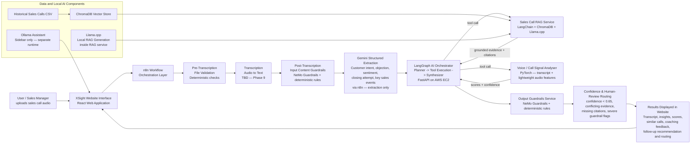

# XSight — Architecture

This document describes the end-to-end architecture of XSight in detail: the high-level flow, every component's responsibility and contract, the request-by-request sequence through the pipeline (including the two-stage guardrails split and the confidence-based human-review path), and the deployment topology. The system-wide flow diagram and full request/response JSON schemas are defined in [../CLAUDE.md](../CLAUDE.md); this document expands on them with the reasoning and detail needed to understand *why* the pipeline is shaped the way it is, not just what it contains. The rationale for each technology choice is in [technology_decisions.md](technology_decisions.md).

## 1. High-level architecture

D1 and D2 are two invocations of the same Guardrails service endpoint (`POST /check/input`), not two services — see §3.3. J is the LangGraph agent — the single AI orchestrator; it is the only component (besides n8n itself) that calls another AI service, and it is n8n that calls only *it*, not H or I directly.

## 2. Design principles behind the flow

- **Guardrails wrap every LLM-facing boundary.** Input is validated twice (once before transcription exists, once after) and output is validated once before anything reaches the user — no unvalidated text crosses from the user into an LLM prompt, or from an LLM output back to the user.
- **Operational orchestration and AI reasoning are two different layers, kept structurally separate.** n8n handles workflow mechanics — webhook, guardrails calls, transcription, routing — and makes exactly one call into AI reasoning: to the LangGraph agent. LangGraph is the only component that calls the RAG Service and the Call Signal Analyser; n8n never calls them directly. This keeps tool selection, evidence reconciliation, and synthesis logic out of the n8n workflow entirely, so the reasoning layer can evolve (new tools, different evidence-weighing logic) without touching orchestration, and vice versa. See [technology_decisions.md](technology_decisions.md#agent--langgraph) for the full rationale.
- **Gemini extracts; LangGraph decides.** Gemini's only job is turning the validated transcript into structured semantic fields. It never generates coaching feedback, recommendations, or the final analysis — that synthesis step belongs entirely to LangGraph, which also has the RAG and signal-analysis evidence Gemini doesn't see. This avoids two components (Gemini and LangGraph) independently producing overlapping, potentially inconsistent judgments about the same call.
- **Every AI service is independently callable and independently testable.** The RAG service, Call Signal Analyser, and LangGraph agent each have their own FastAPI endpoint, their own input/output contract, and no direct dependency on each other's internals.
- **Low confidence — or unresolved disagreement — routes to a human, not a guess.** Whenever the pipeline cannot support a confident, consistent answer, the result is explicitly marked `human_review_required` rather than silently returned as if it were certain (see §3.8).
- **Grounding is enforced structurally, not just by instruction.** The RAG service's citation requirement, LangGraph's evidence-conflict detection, and the output guardrails' citation check are independent layers — a prompt asking the model to cite sources is not trusted alone.

## 3. Request lifecycle, step by step

This section walks through one full analysis request in the order it actually executes, referencing the n8n node numbers from [CLAUDE.md](../CLAUDE.md#2-n8n-cloud-workflow).

### 3.1 Submission (React → n8n)

The user submits the upload form (audio file, agent name, call date, optional customer/company name, optional notes) from the React app. The form POSTs to the n8n Cloud webhook (node 1), which is the single entry point into the backend — the React app never calls any FastAPI service directly.

### 3.2 Pre-transcription file validation (n8n nodes 2–3)

Before a transcript exists, only the uploaded file and form metadata can be validated. n8n calls the Guardrails service's `POST /check/input` with the file/metadata payload. The service applies deterministic checks only at this stage — an LLM rail has nothing useful to say about whether a file is a valid MIME type or under the size limit:

- audio file exists
- supported MIME type and extension
- file size limit
- optional duration limit
- required metadata present (agent name, call date, etc.)
- submission structure is not malformed or suspicious

An IF node (node 3) branches on the result: fail → respond immediately with a rejection, no further processing; pass → continue to transcription.

### 3.3 Transcription (n8n node 4)

The audio file is sent to the transcription API (provider TBD — Phase 9). Output is a transcript, ideally speaker-tagged (`Agent:`/`Customer:`) if the chosen provider supports diarization — this tagging is what later enables `agent_talk_ratio` in the Call Signal Analyser.

### 3.4 Post-transcription input content guardrails (n8n nodes 5–6)

Now that the transcript exists, n8n calls the *same* `POST /check/input` endpoint again, this time with the transcript text. The service applies NeMo rails plus deterministic checks appropriate to text content:

- transcript not empty or too short
- content is actually a sales call (off-topic rejection)
- offensive content detection
- prompt injection / instruction-override attempts
- optional language validation

The endpoint's behavior is driven entirely by what's in the request payload (file-only vs. transcript-present), not by a flag identifying which orchestration step is calling it — see [technology_decisions.md](technology_decisions.md#guardrails--nemo-guardrails--fastapi--deterministic-custom-validation-rules) for why this was kept as one endpoint. Another IF node (node 6) branches: fail → reject; pass → continue.

### 3.5 Structured semantic extraction (n8n node 7)

Gemini (via an n8n node) reads the validated transcript and extracts structured fields: customer intent, main objection, customer sentiment, closing attempt, key sales events, and relevant call metadata. This is the first and *only* LLM call n8n makes that reads the transcript — Gemini's output is extraction only, not analysis, and it never generates coaching feedback, recommendations, or a final result.

### 3.6 LangGraph orchestration (n8n node 8, single call)

n8n makes exactly one call here — to the LangGraph agent's `POST /agent/run` — passing the transcript, metadata, and Gemini's structured extraction. Everything from this point until the LangGraph agent returns happens *inside* that one request/response cycle, driven by LangGraph itself rather than by further n8n nodes:

1. **Planner node** decides which tools are needed for this call.
2. **Tool execution node** invokes the tools directly via their FastAPI endpoints:
   - **RAG Service** (`POST /query`) — retrieves similar historical calls from ChromaDB, cited by `call_id`.
   - **Call Signal Analyser** (`POST /analyse-call`) — scores the call (predicted outcome, lead quality, agent performance, risk level) from transcript, Gemini's structured-extraction fields, and lightweight audio-derived features, returning a `confidence` value and a `feature_summary`.
3. **Synthesizer node** combines the transcript, Gemini's extraction, the RAG evidence, and the signal-analyser scores; checks for conflicting, missing, or insufficient evidence between the two tool outputs (populating `evidence_conflicts` if any); and generates the coaching feedback, recommended next action, follow-up email, and the rest of the final output fields, with explicit `reasoning_steps` and `tools_used` for transparency.

LangGraph returns the complete final output JSON (see [CLAUDE.md §6](../CLAUDE.md#6-langgraph-sales-agent)) directly to n8n — there is no separate "final analysis generation" LLM step afterward; LangGraph's synthesizer *is* that step.

### 3.7 Output guardrails (n8n node 9)

LangGraph's assembled result is sent to `POST /check/output`, which checks for invented CRM facts, unsupported business conclusions, fake legal/financial promises, overconfident recommendations, invented call details, and — critically — that every claim about a historical call carries a `call_id` citation.

### 3.8 Human-review routing (n8n node 10)

An IF node inspects several signals together, per the human review routing rule in [CLAUDE.md](../CLAUDE.md#2-n8n-cloud-workflow):

- `confidence < 0.65` (from the Call Signal Analyser, carried through LangGraph's output) → `human_review_required`.
- `evidence_conflicts` is non-empty (LangGraph detected disagreement between RAG and the signal analyser) → `human_review_required`.
- required supporting evidence or `call_id` citations are missing → `human_review_required`.
- output guardrails flagged a severe issue → `flagged` or `human_review_required` depending on severity.
- a required tool failed and LangGraph could not produce a sufficiently grounded result → `human_review_required`.
- otherwise → `pass`, return the result directly.

This is the only branching point in the pipeline that can override an otherwise-passing result — it exists specifically so a technically-valid-but-uncertain or internally-inconsistent analysis is never presented to the user as if it were reliable.

### 3.9 Response (n8n → React)

n8n responds to the original webhook call with the final JSON payload (node 11). React renders it on the Results Page; `guardrail_status` in the payload (`pass | flagged | human_review_required`) drives whether the UI shows the result normally or with a review banner.

## 4. Component responsibility matrix

| Component | Location | Endpoint(s) | Called by | Depends on | Responsibility |
|---|---|---|---|---|---|
| React app | `frontend/` | — (calls n8n webhook) | User | n8n webhook | UI only |
| n8n workflow | `n8n/` | Webhook trigger | React | Guardrails, Transcription, Gemini, LangGraph agent | operational workflow orchestration only — no AI reasoning |
| Guardrails service | `services/guardrails_service` | `POST /check/input`, `POST /check/output` | n8n | NeMo Guardrails | input validation (both stages) and final-output validation only |
| Transcription | external (TBD) | provider-specific | n8n | — | audio → text only |
| Gemini | external API | via n8n node | n8n | — | structured semantic extraction only — never generates coaching feedback, recommendations, or the final analysis |
| LangGraph agent | `services/langgraph_agent` | `POST /agent/run` | n8n (single call) | RAG service, Call Signal Analyser | **the single AI orchestrator and final synthesis layer** — tool selection, evidence reconciliation, reasoning, final output generation |
| RAG service | `services/rag_service` | `POST /query` | LangGraph agent only | ChromaDB, Llama.cpp, historical calls CSV | retrieval of grounded historical-call evidence only |
| Call Signal Analyser | `services/call_signal_analyser` | `POST /analyse-call` | LangGraph agent only | trained PyTorch model | prediction, scoring, confidence estimation only — consumes Gemini's extraction rather than re-deriving it |
| Ollama assistant | external runtime | local HTTP API | React sidebar only | — (independent of Llama.cpp) | conversational sidebar assistant only |

Only n8n and the LangGraph agent call more than one other component — every other component is a leaf that one caller invokes and returns to.

## 5. Data flow

- **Historical Sales Calls CSV** (`data/historical_sales_calls.csv`) is the single source of truth for both: the RAG corpus (ingested into ChromaDB with HuggingFace embeddings) and the Call Signal Analyser's training data (loaded via pandas for PyTorch training, offline). See [technology_decisions.md](technology_decisions.md#dataset-design-two-separate-datasets-not-one) for why these are treated as two logically separate datasets sourced from the same file.
- **ChromaDB** is populated once (offline ingestion step) from the CSV's RAG-corpus rows and queried at request time by the RAG service — it is not written to during a normal analysis request.
- **Llama.cpp** runs only inside the RAG service process, generating the grounded, citation-constrained `insight` text from the retrieved calls.
- **Ollama** runs as a fully separate process, serving only the React sidebar assistant; it never touches the RAG service, the historical calls data, or ChromaDB directly.

## 6. Deployment topology

### Local development (Phases 1–15)

All four FastAPI services, plus ChromaDB (embedded) and the Llama.cpp/Ollama runtimes, run locally — via Docker Compose from Phase 7 onward. n8n Cloud cannot reach `localhost`, so local services are exposed to it through ngrok or a Cloudflare Tunnel, or n8n itself is run locally in Docker Compose during early phases (decision documented at Phase 9, per [CLAUDE.md](../CLAUDE.md#n8n-and-local-services-connectivity-note)). The React frontend does not exist yet during this period; every service is exercised via curl, Postman, or direct n8n webhook calls.

### Production (Phase 19+)

The same Docker Compose configuration is deployed to a single AWS EC2 instance, so the local and production environments match as closely as possible. n8n Cloud calls the EC2-hosted services directly (no tunnel needed once there's a public endpoint). React is built and served separately (static hosting or the same instance, decided at Phase 19).

## 7. Error and rejection paths

| Failure point | Trigger | Result |
|---|---|---|
| Pre-transcription file validation fails | invalid file type, oversized file, missing metadata | immediate rejection, no transcription attempted |
| Post-transcription content guardrails fail | off-topic, offensive, empty transcript, prompt injection | rejection after transcription, LangGraph never invoked |
| Call Signal Analyser confidence < 0.65 | model uncertain | `human_review_required`, result still returned but flagged |
| LangGraph detects conflicting evidence | RAG and Call Signal Analyser disagree, or required citations/evidence are missing | `evidence_conflicts` populated, routed to `human_review_required` |
| A tool LangGraph depends on fails | RAG service or Call Signal Analyser unreachable/erroring | LangGraph cannot produce a sufficiently grounded result → `human_review_required` |
| Output guardrails flag the result | invented facts, missing citations, overconfident claims | `flagged` or `human_review_required` depending on severity |
| Any FastAPI service unreachable/erroring | infra issue | calling node fails; webhook returns an error response (exact retry/error-handling behavior finalized at Phase 10) |

## 8. Open items carried from technology decisions

- Exact transcription provider (Phase 9) — affects whether diarization is available, which in turn affects whether `agent_talk_ratio` can be computed.
- n8n-to-localhost connectivity approach for development (Phase 9).
- Exact lightweight audio library and audio-file input contract for the Call Signal Analyser (Phase 13).
- LLM backend for LangGraph's Planner/Synthesizer nodes (Phase 14) — not yet decided; see [CLAUDE.md §6](../CLAUDE.md#6-langgraph-sales-agent).
