# XSight — Architecture

This document describes the end-to-end architecture of XSight in detail: the high-level flow, every component's responsibility and contract, the request-by-request sequence through the pipeline (including the two-stage guardrails split and the confidence-based human-review path), and the deployment topology. The system-wide flow diagram and full request/response JSON schemas are defined in [../CLAUDE.md](../CLAUDE.md); this document expands on them with the reasoning and detail needed to understand *why* the pipeline is shaped the way it is, not just what it contains. The rationale for each technology choice is in [technology_decisions.md](technology_decisions.md).

## 1. High-level architecture

```mermaid
flowchart LR

    A["User / Sales Manager\nuploads sales call audio"]
    --> B["XSight Website Interface\nReact Web Application"]

    B --> C["n8n Workflow\nOrchestration Layer"]

    C --> D1["Pre-Transcription\nFile Validation\nDeterministic checks"]

    D1 --> E["Transcription\nAudio to Text\nTBD — Phase 9"]

    E --> D2["Post-Transcription\nInput Content Guardrails\nNeMo Guardrails + deterministic rules"]

    D2 --> F["Gemini Information Extractor\nCustomer intent, objection, sentiment,\nclosing attempt, key sales events\nvia n8n — extraction only"]

    F --> AA["n8n AI Agent Node\nIntent classification, field enrichment,\nservice relevance, payload prep\nlimited role — no reasoning, no final report"]

    AA --> H["Sales Call RAG Service\nLangChain + ChromaDB + Llama.cpp"]
    AA --> I["Voice / Call Signal Analyser\nPyTorch — transcript + lightweight audio features"]

    H --> MG["Merge Results"]
    I --> MG

    MG --> J["LangGraph Agent\nMulti-step reasoning over transcript,\nextraction, enrichment, RAG + signal results\nFastAPI on AWS EC2"]

    J --> Z["Gemini Final Analysis LLM Chain\nCombines extraction, enrichment, RAG evidence,\nsignal scores and LangGraph reasoning\ninto the complete final output JSON — via n8n"]

    Z --> L["Output Guardrails Service\nNeMo Guardrails + deterministic rules"]

    L --> R["Router\nConfidence & category routing —\nconfidence < 0.65, conflicting evidence,\nmissing citations, severe guardrail flags"]

    R --> M["Results Displayed in Website\nTranscript, insights, scores,\nsimilar calls, coaching feedback,\nfollow-up recommendation and routing"]

    M --> B

    subgraph DataModels["Data and Local AI Components"]
        N["historical_sales_calls.csv\nRAG corpus"]
        O["ChromaDB Vector Store"]
        P["Llama.cpp\nLocal RAG Generation\ninside RAG service"]
        Q["Ollama Assistant\nSidebar only — separate runtime"]
        T["call_signal_training.csv\nClassifier training data"]
    end

    N --> O
    O --> H
    P --> H
    Q --> B
    T -.->|offline training, Phase 13| I
```

D1 and D2 are two invocations of the same Guardrails service endpoint (`POST /check/input`), not two services — see §3.2 and §3.4. n8n (C) is the central orchestrator — it calls every AI component directly: the Gemini Information Extractor (F), the n8n AI Agent Node (AA), the RAG Service (H) and Call Signal Analyser (I) in parallel, the LangGraph agent (J), and the Gemini Final Analysis LLM Chain (Z). AA is a limited-role node — it classifies intent, enriches fields, decides which of H/I to call, and prepares their payloads, but does not reason over results or touch the final report. LangGraph does not call H or I itself — n8n fetches their results first (merged at MG) and passes both into J. Z, not J, produces the complete final output.

## 2. Design principles behind the flow

- **Guardrails wrap every LLM-facing boundary.** Input is validated twice (once before transcription exists, once after) and output is validated once before anything reaches the user — no unvalidated text crosses from the user into an LLM prompt, or from an LLM output back to the user.
- **n8n is the single central orchestrator.** Every AI call in the pipeline — guardrails, transcription, the Gemini extractor, the n8n AI Agent Node, the RAG Service, the Call Signal Analyser, the LangGraph agent, and the Gemini Final Analysis Chain — is invoked directly by n8n. No AI component calls another AI component; each is a leaf n8n calls and gets a result back from. This keeps the entire pipeline visible and debuggable in one place: the n8n execution log shows every step, in order, with its own input and output, rather than opaque work happening inside a single downstream service call.
- **The AI Agent Node prepares; it doesn't decide or reconcile.** Between extraction and the parallel service calls, a limited-role n8n AI Agent Node classifies the submission's intent, enriches the extracted fields, decides which of the two downstream services are relevant, and prepares their request payloads. It stops there — it does not reason over results (there are none yet at this point), does not generate coaching feedback, does not reconcile evidence, and does not invent information the extraction didn't provide. Keeping this node narrowly scoped avoids a second, competing "reasoning" surface alongside LangGraph — enrichment and reasoning are different jobs, done by different nodes.
- **Gemini extracts, then later synthesizes — LangGraph reasons in between.** The Gemini Information Extractor's only job is turning the validated transcript into structured semantic fields; it never generates coaching feedback or a final analysis. Once n8n has gathered the extraction, the AI Agent Node's enrichment, the RAG evidence, and the signal-analyser scores, it hands all of that to the LangGraph agent for multi-step reasoning (evidence-conflict detection, coaching points, a recommended action) — but LangGraph's reasoning output is still not the final report. n8n passes that reasoning output, together with everything else it has gathered, to a second Gemini call — the Final Analysis LLM Chain — which is the one component that actually assembles the complete final output JSON.
- **Every AI service is independently callable and independently testable.** The RAG service, Call Signal Analyser, and LangGraph agent each have their own FastAPI endpoint, their own input/output contract, and no direct dependency on each other's internals — n8n is the only component that calls more than one of them.
- **Low confidence — or unresolved disagreement — routes to a human, not a guess.** Whenever the pipeline cannot support a confident, consistent answer, the result is explicitly marked `human_review_required` rather than silently returned as if it were certain (see §3.11).
- **Grounding is enforced structurally, not just by instruction.** The RAG service's citation requirement, LangGraph's evidence-conflict detection, and the output guardrails' citation check are independent layers — a prompt asking a model to cite sources is not trusted alone.

## 3. Request lifecycle, step by step

This section walks through one full analysis request in the order it actually executes, referencing the n8n node numbers from [CLAUDE.md](../CLAUDE.md#2-n8n-cloud-workflow).

### 3.1 Submission (React → n8n)

The user submits the upload form (audio file, agent name, call date, optional customer/company name, optional notes) from the React app. The form POSTs to the n8n Cloud webhook (node 1), which is the single entry point into the backend — the React app never calls any FastAPI service directly.

### 3.2 Pre-transcription file validation (n8n nodes 2–3)

Before a transcript exists, only the uploaded file and form metadata can be validated. n8n calls the Guardrails service's `POST /check/input` with the file/metadata payload. The service applies deterministic checks only at this stage — an LLM rail has nothing useful to say about whether a file is a valid MIME type or under the size limit:

- audio file exists
- supported MIME type and extension
- file size limit
- optional duration limit
- required metadata present (agent name, call date, etc.)
- submission structure is not malformed or suspicious

An IF node (node 3) branches on the result: fail → respond immediately with a rejection, no further processing; pass → continue to transcription.

### 3.3 Transcription (n8n node 4)

The audio file is sent to the transcription API (provider TBD — Phase 9). Output is a transcript, ideally speaker-tagged (`Agent:`/`Customer:`) if the chosen provider supports diarization — this tagging is what later enables `agent_talk_ratio` in the Call Signal Analyser.

### 3.4 Post-transcription input content guardrails (n8n nodes 5–6)

Now that the transcript exists, n8n calls the *same* `POST /check/input` endpoint again, this time with the transcript text. The service applies NeMo rails plus deterministic checks appropriate to text content:

- transcript not empty or too short
- content is actually a sales call (off-topic rejection)
- offensive content detection
- prompt injection / instruction-override attempts
- optional language validation

The endpoint's behavior is driven entirely by what's in the request payload (file-only vs. transcript-present), not by a flag identifying which orchestration step is calling it — see [technology_decisions.md](technology_decisions.md#guardrails--nemo-guardrails--fastapi--deterministic-custom-validation-rules) for why this was kept as one endpoint. Another IF node (node 6) branches: fail → reject; pass → continue.

### 3.5 Structured semantic extraction (n8n node 7)

Gemini (via an n8n node) reads the validated transcript and extracts structured fields: customer intent, main objection, customer sentiment, closing attempt, key sales events, and relevant call metadata. Gemini's output here is extraction only, not analysis — it never generates coaching feedback, recommendations, or a final result.

### 3.6 n8n AI Agent Node (n8n node 8)

n8n calls a dedicated AI Agent Node — a limited-role node running inside the n8n workflow itself (not a separate FastAPI service). It takes the transcript, metadata, and Gemini's extraction, and:

1. **Classifies the submission intent** — what kind of call/analysis this is.
2. **Enriches the extracted sales fields** — normalizes or augments what the Information Extractor produced.
3. **Determines which downstream analysis services are relevant** for this specific call (in the common case, both; the node has the authority to decide otherwise).
4. **Prepares the structured request payloads** that nodes 9 and 10 send to the RAG Service and Call Signal Analyser.

It explicitly does **not**: generate the final report, replace LangGraph's reasoning, generate coaching feedback, reconcile evidence, or invent missing information. There is no evidence to reason over yet at this point in the pipeline — that happens later, in LangGraph (3.8).

### 3.7 Parallel AI service calls (n8n nodes 9–11)

n8n fans out to two independent FastAPI services at once, using the payloads the AI Agent Node prepared, since neither depends on the other's output:

- **RAG Service** (`POST /query`, node 9) — retrieves similar historical calls from ChromaDB, cited by `call_id`.
- **Call Signal Analyser** (`POST /analyse-call`, node 10) — receives the audio file (or a reference to it) alongside the transcript and extraction, performs its own lightweight audio preprocessing, and scores the call (predicted outcome, lead quality, agent performance, risk level) returning a `confidence` value and a `feature_summary`.

A Merge Results node (node 11) waits for both branches to complete before continuing — the next step needs both results.

### 3.8 LangGraph reasoning (n8n node 12)

n8n calls the LangGraph agent's `POST /agent/run`, passing the transcript, metadata, Gemini's structured extraction, the AI Agent Node's enrichment, the RAG Service's results, and the Call Signal Analyser's results. LangGraph does **not** call the RAG Service or Call Signal Analyser itself — by this point n8n has already fetched and merged both, in the previous step, and hands them to LangGraph as input. This is why LangGraph runs *after* the parallel RAG/Call-Signal-Analyser calls: it consumes both of their results rather than producing them. Internally:

1. **Planner node** decides how to weigh the RAG evidence against the signal-analyser scores for this call.
2. **Tool execution node** — in this design, "tools" are the already-provided RAG and Call Signal Analyser results, not live HTTP calls; this node reasons over that pre-fetched evidence.
3. **Synthesizer node** cross-checks the RAG evidence against the signal-analyser scores, detects conflicting, missing, or insufficient evidence (populating `evidence_conflicts` if any), and produces `reasoning_steps`, `coaching_points`, and a `recommended_next_action`.

LangGraph returns this reasoning output to n8n — it is **not** the complete final report. See [CLAUDE.md §6](../CLAUDE.md#6-langgraph-sales-agent) for the exact shape.

### 3.9 Gemini Final Analysis LLM Chain (n8n node 13)

n8n makes a second Gemini call, passing everything gathered so far: the structured extraction (3.5), the AI Agent Node's enrichment (3.6), the RAG results and Call Signal Analyser results (3.7), and LangGraph's reasoning output (3.8). This chain is the component that actually assembles the complete final output JSON — `call_summary`, `customer_intent`, `main_objection`, `customer_sentiment`, `call_outcome`, `agent_performance_score`, `lead_quality_score`, `similar_calls`, `coaching_feedback`, `recommended_next_action`, `suggested_follow_up_email`, `routing_category`, `confidence`, `risk_level`, `detected_signals`, and `limitations` (see the [final output JSON schema](../CLAUDE.md#final-output-json-schema-contract-between-backend-and-react-frontend)). Neither the Information Extractor (3.5), the AI Agent Node (3.6), nor LangGraph (3.8) does this assembly — this is the one step that does.

### 3.10 Output guardrails (n8n node 14)

The Final Analysis Chain's assembled result is sent to `POST /check/output`, which checks for invented CRM facts, unsupported business conclusions, fake legal/financial promises, overconfident recommendations, invented call details, and — critically — that every claim about a historical call carries a `call_id` citation.

### 3.11 Router — confidence and category routing (n8n node 15)

An IF node (the Router) inspects several signals together, per the confidence and category routing rule in [CLAUDE.md](../CLAUDE.md#2-n8n-cloud-workflow):

- `confidence < 0.65` (from the Call Signal Analyser, carried through to the final output) → `human_review_required`.
- `evidence_conflicts` is non-empty (LangGraph detected disagreement between RAG and the signal analyser) → `human_review_required`.
- required supporting evidence or `call_id` citations are missing → `human_review_required`.
- output guardrails flagged a severe issue → `flagged` or `human_review_required` depending on severity.
- a required upstream call (RAG Service, Call Signal Analyser, or LangGraph agent) failed and the Final Analysis Chain could not produce a sufficiently grounded result → `human_review_required`.
- otherwise → the Router also assigns `routing_category` and returns `guardrail_status: pass`.

This is the only branching point in the pipeline that can override an otherwise-passing result — it exists specifically so a technically-valid-but-uncertain or internally-inconsistent analysis is never presented to the user as if it were reliable.

### 3.12 Response (n8n → React)

n8n responds to the original webhook call with the final JSON payload (node 16). React renders it on the Results Page; `guardrail_status` in the payload (`pass | flagged | human_review_required`) drives whether the UI shows the result normally or with a review banner.

## 4. Component responsibility matrix

| Component | Location | Endpoint(s) | Called by | Depends on | Responsibility |
|---|---|---|---|---|---|
| React app | `frontend/` | — (calls n8n webhook) | User | n8n webhook | UI only |
| n8n workflow | `n8n/` | Webhook trigger | React | Guardrails, Transcription, Gemini (x2), RAG service, Call Signal Analyser, LangGraph agent | **the central workflow orchestrator** — calls every AI component directly and assembles the pipeline |
| Guardrails service | `services/guardrails_service` | `POST /check/input`, `POST /check/output` | n8n | NeMo Guardrails | input validation (both stages) and final-output validation only |
| Transcription | external (TBD) | provider-specific | n8n | — | audio → text only |
| Gemini — Information Extractor | external API | via n8n node | n8n | — | structured semantic extraction only — never generates coaching feedback, recommendations, or the final analysis |
| n8n AI Agent Node | inside the n8n workflow (not a separate service) | n8n node | n8n | Gemini's extraction | **limited role**: classify submission intent, enrich extracted fields, determine which downstream services are relevant, prepare their payloads. Must not reason over results, generate coaching feedback, reconcile evidence, or invent information |
| RAG service | `services/rag_service` | `POST /query` | n8n, directly (parallel with Call Signal Analyser), using the AI Agent Node's payload | ChromaDB, Llama.cpp, `historical_sales_calls.csv` | retrieval of grounded historical-call evidence only |
| Call Signal Analyser | `services/call_signal_analyser` | `POST /analyse-call` | n8n, directly (parallel with RAG service), using the AI Agent Node's payload | trained PyTorch model, the audio file (forwarded by n8n) | prediction, scoring, confidence estimation only — consumes Gemini's extraction rather than re-deriving it; performs its own lightweight audio preprocessing |
| LangGraph agent | `services/langgraph_agent` | `POST /agent/run` | n8n, after RAG + Call Signal Analyser both return and are merged | none (reasons over data n8n provides — does not call other services) | multi-step reasoning only — evidence-conflict detection, coaching points, recommended action; does **not** produce the final report |
| Gemini — Final Analysis LLM Chain | external API | via n8n node | n8n, after LangGraph returns | — (reads what n8n passes it) | **the component that assembles the complete final output JSON**, from the extraction, RAG results, signal-analyser results, and LangGraph's reasoning |
| Ollama assistant | external runtime | local HTTP API | React sidebar only | — (independent of Llama.cpp) | conversational sidebar assistant only |

n8n is the only component that calls more than one other component — every AI service is a leaf n8n calls directly and gets a result back from; none of them call each other.

## 5. Data flow

- **`data/historical_sales_calls.csv`** — the RAG corpus: at least 20 detailed historical call transcripts with rich metadata. Ingested into ChromaDB with HuggingFace embeddings (offline step); queried at request time by the RAG service.
- **`data/call_signal_training.csv`** — the classifier training dataset: ~150–300 synthetic/adapted feature rows (no full transcripts), loaded via pandas for PyTorch training (offline, Phase 13). This is a separate file from the RAG corpus, not the same file reused — see [technology_decisions.md](technology_decisions.md#dataset-design-two-separate-files-not-one) for why. The two files share a compatible column schema (the training file omits `transcript`) so feature-engineering code can be reused between them.
- **ChromaDB** is populated once (offline ingestion step) from `historical_sales_calls.csv` and queried at request time by the RAG service — it is not written to during a normal analysis request.
- **Llama.cpp** runs only inside the RAG service process, generating the grounded, citation-constrained `insight` text from the retrieved calls.
- **Ollama** runs as a fully separate process, serving only the React sidebar assistant; it never touches the RAG service, the historical calls data, or ChromaDB directly.
- **The audio file** is validated (Stage A), sent to the transcription API, and also forwarded by n8n to the Call Signal Analyser's request payload — that service performs its own lightweight audio preprocessing internally rather than relying on a separate preprocessing step or service.

## 6. Deployment topology

### Local development (Phases 1–15)

All four FastAPI services, plus ChromaDB (embedded) and the Llama.cpp/Ollama runtimes, run locally — via Docker Compose from Phase 7 onward. n8n Cloud cannot reach `localhost`, so local services are exposed to it through ngrok or a Cloudflare Tunnel, or n8n itself is run locally in Docker Compose during early phases (decision documented at Phase 9, per [CLAUDE.md](../CLAUDE.md#n8n-and-local-services-connectivity-note)). The React frontend does not exist yet during this period; every service is exercised via curl, Postman, or direct n8n webhook calls.

### Production (Phase 19+)

The same Docker Compose configuration is deployed to a single AWS EC2 instance, so the local and production environments match as closely as possible. n8n Cloud calls the EC2-hosted services directly (no tunnel needed once there's a public endpoint). React is built and served separately (static hosting or the same instance, decided at Phase 19).

## 7. Error and rejection paths

| Failure point | Trigger | Result |
|---|---|---|
| Pre-transcription file validation fails | invalid file type, oversized file, missing metadata | immediate rejection, no transcription attempted |
| Post-transcription content guardrails fail | off-topic, offensive, empty transcript, prompt injection | rejection after transcription, no AI services called |
| n8n AI Agent Node fails or errors | infra issue, or it cannot classify/enrich the submission | n8n node fails before the parallel RAG/Call Signal Analyser calls are made |
| RAG service or Call Signal Analyser unreachable/erroring | infra issue during the parallel calls | n8n node fails before LangGraph is ever called |
| Call Signal Analyser confidence < 0.65 | model uncertain | `human_review_required`, result still returned but flagged |
| LangGraph detects conflicting evidence | RAG and Call Signal Analyser disagree, or required citations/evidence are missing | `evidence_conflicts` populated, routed to `human_review_required` |
| LangGraph agent unreachable/erroring | infra issue | n8n node fails; the Final Analysis Chain is never called |
| Output guardrails flag the result | invented facts, missing citations, overconfident claims | `flagged` or `human_review_required` depending on severity |
| Any FastAPI service unreachable/erroring | infra issue | calling node fails; webhook returns an error response (exact retry/error-handling behavior finalized at Phase 10) |

## 8. Open items carried from technology decisions

- Exact transcription provider (Phase 9) — affects whether diarization is available, which in turn affects whether `agent_talk_ratio` can be computed.
- n8n-to-localhost connectivity approach for development (Phase 9).
- Exact lightweight audio library for the Call Signal Analyser, and the exact mechanism n8n uses to forward the audio file/reference to it (Phase 13) — the design decision that the analyser preprocesses audio itself (rather than a separate preprocessing service) is settled; the implementation detail is not.
- LLM backend for LangGraph's Planner/Synthesizer nodes (Phase 14) — not yet decided; see [CLAUDE.md §6](../CLAUDE.md#6-langgraph-sales-agent).
- Exact classification/enrichment logic and the underlying model for the n8n AI Agent Node (Phase 9–10 n8n wiring) — the node's scope is fixed (see §3.6), but which LLM backs it is not yet specified.
